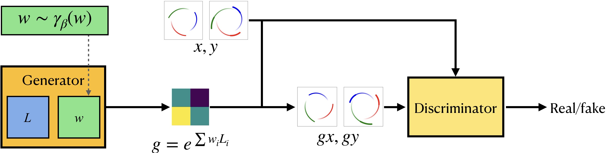

# Generative Adversarial Symmetry Discovery (LieGAN)
Code for the ICML 2023 paper, [Generative Adversarial Symmetry Discovery](https://arxiv.org/abs/2302.00236).



## Experiments
### N-Body Trajectory
To discover symmetry from the task of 2-body trajectory prediction, run one of the following:
```
# LieGAN
python main_lagan.py --g_init 2*2_factorization --lamda 1 --sigma_init 1 --num_epochs 100
# Augerino*
python main_augerino.py --g_init 2*2_factorization --lamda 1 --num_epochs 100
# SymmetryGAN
python main_lagan.py --g_init 2*2_factorization --lamda 1 --sigma_init 1 --num_epochs 100 --model sgan
```

To discover symmetry in a larger search space (Figure 3c), run the following:
```
python main_lagan.py --g_init 4*4_factorization --lamda 1e1 --sigma_init 3 --num_epochs 100
```

To run the prediction experiments for EMLP and data augmentation, refer to `emlp.ipynb` and `aug_pred.ipynb`. We have provided the discovery results used for these experiments in `./saved_model/results/`.

As is stated in Section 5.2 in our paper, we need to slightly modify the EMLP implementation of SVD. It is located in line 307 of `emlp/reps/representation.py`, where we need to change the threshold from 1e-5 to larger values, like 5e-3.

To discover symmetry from the task of 3-body trajectory prediction:
```
python main_lagan.py --task traj_pred_3body --dataset_name 3body --g_init 2*2_factorization --lamda 1 --sigma_init 1
```

### Discrete Rotation Invariant Regression
```
python main_lagan.py --task discrete_rotation_synthetic --dataset_size 20000 --y_type scalar --coef_dist uniform_int_grid --uniform_max 10
```

### Top Tagging
To discover symmetry, first download the [top tagging dataset](https://zenodo.org/record/2603256) to `./data/top-tagging`. We only need `train.h5` for symmetry discovery purpose. Then run the following command:
```
python main_lagan.py --task top_tagging --lamda 1 --g_init random --n_channel 7 --y_type scalar --sigma_init 1 --eta 0.1 --n_component 2
```

To run the top tagging prediction task, first download the converted dataset from [this link](https://osf.io/7u3fk/?view_only=8c42f1b112ab4a43bcf208012f9db2df) to the data directory `./data/top-tagging-converted`. Then,
```
cd LorentzNet
```
The content of this directory is modified from the codebase of [LorentzNet](https://github.com/sdogsq/LorentzNet-release). We mainly made our modifications in the file `models.py`, where we implemented LieGNN as proposed in our paper. To run the experiments:
```
# LorentzNet (original)
python -m torch.distributed.launch --nproc_per_node=4 top_tagging.py \
        --batch_size=32 --epochs=35 --warmup_epochs=5 \
        --n_layers=6 --n_hidden=72 --lr=3e-4 \
        --c_weight=0.005 --dropout=0.2 --weight_decay=0.01 \
        --exp_name=lorentznet --datadir ../data/top-tagging-converted
# LieGNN (symmetry discovered by LieGAN)
python -m torch.distributed.launch --nproc_per_node=4 top_tagging.py \
        --batch_size=32 --epochs=35 --warmup_epochs=5 \
        --n_layers=6 --n_hidden=72 --lr=3e-4 \
        --c_weight=0.005 --dropout=0.2 --weight_decay=0.01 \
        --exp_name=liegnn --datadir ../data/top-tagging-converted --metric saved_metric/metric_liegan.pt
# Augerino+GNN (symmetry discovered by Augerino+)
python -m torch.distributed.launch --nproc_per_node=4 top_tagging.py \
        --batch_size=32 --epochs=35 --warmup_epochs=5 \
        --n_layers=6 --n_hidden=72 --lr=3e-4 \
        --c_weight=0.005 --dropout=0.2 --weight_decay=0.01 \
        --exp_name=augerino --datadir ../data/top-tagging-converted --metric saved_metric/metric_augerino.pt
```

### Rotated MNIST
```
python main_lagan.py --task MNIST --g_init affine --x_type grid --y_type scalar --lamda 0.1 --lr_g 2e-4 --reg_type fourier --num_epochs 15
```

## Cite
```
@article{yang2023generative,
  title={Generative Adversarial Symmetry Discovery},
  author={Yang, Jianke and Walters, Robin and Dehmamy, Nima and Yu, Rose},
  journal={International Conference on Machine Learning},
  organization={PMLR},
  year={2023}
}

```
